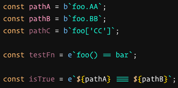
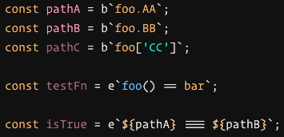

# VSCode Player

An extension for working with Player content in VSCode.

# Installation

Install it from the VSCode Registry [here]()

## Language Features
> Utilities to assist with the embedded bindings and expressions in [Player](https://player-ui.github.io/latest/tools/dsl#bindingsexpressions).

### Syntax Highlighting

| Before                             | After                            |
| ---------------------------------- | -------------------------------- |
|  |  |